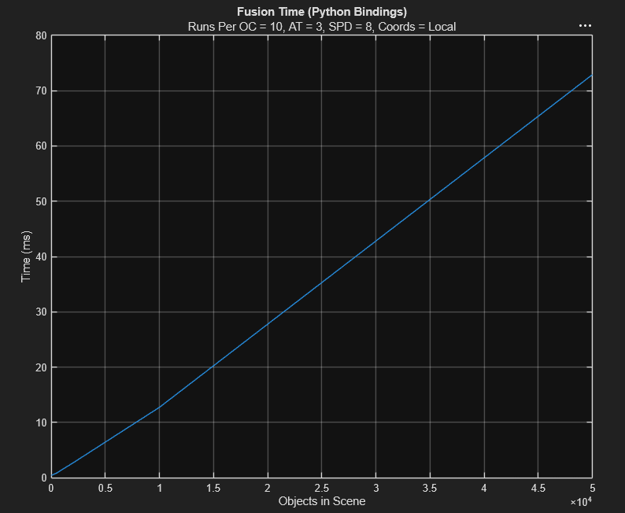

# SAHFTE

## Lisence & Attribution

SAHFTE is distributed under the 3-Clause BSD Lisence, feel free to take, modify, and explore, so long as proper attribution is given to the author!

Special thanks to the project's Faculty Advisor, Prof. Junaid Khan, and as always to my favorite CS teacher, Michael Conklin of University High-School

**If you learn something, like something, or enjoy any part of this, consider following me on LinkedIn, or even better give me a job offer :)**

## Spatial Algorithmic Hashing Fusion Time-sliced Engine

SAHFTE is a 3D fusion system developed as a part of a senior project for PACCAR Inc, by Moose Abou-Harb. SAHFTE is designed to provide a quick drop in solution for basic 3D bounding box sensor fusion with built in support for:

- Customizable confidence on a per-class and per-modality basis
- Distributed work across a threadpool
- Built in tools to convert from local-space to world-space (Latitude, Longitude, Altitude)
- Auto-generated Python Bindings
- An easy to use simple API that is well commented

What SAHFTE is NOT:
* A statistical model, this project is purely algorithmic and has no option as of yet to include statistical information like position and size confidence, the only statistical value that SAHFTE cares about is the confidence of the provided class label
* Completely optimal, while SAHFTE uses several optimizations, this is for an undergrad project, and I have not had the time or real need to hammer this into the most performant form it can be. That being said however, it should still be pretty darn fast

While it may not be the most complicated, feature rich or technically amazing thing in the world, it is still at the very least pretty speedy, and under testing generally has linear `O(n)` behavior, at least for total inference counts in the range of **[1, 150,000]**, that represent 50,000 ground truth objects in a field of 100m^3 around the hypothetical sensor bed, as this test shows.



## Python Quick Start

1. Pull down the repo
2. In the root of the project run `cmake -S . -DBUILD_PYTHON_BINDINGS=ON -DCMAKE_BUILD_TYPE=Release -B build -G Ninja && cmake --build build`
3. run `pip install .` in the project root to install to your python path

> Note building with `-DUSE_STD_FORMAT=OFF` will disable any dependency on `std::format` for older, uncompliant compilers

> Note that this will only work for linux distros, dont try this on windows

> Note use `-DUSE_INTEL_TBB=ON` to enable searching and linking against intel
thread building blocks

## New Changes with ~~V2~~ V3

* ~~SAHFTE now accepts input infereneces as heap free objects, this prevents alot of
redundant allocation when pushing in inferences, makes the input buffer trivially
destructible, and improves performance. This is acheived by replacing `string`s with `string_view`s
which is a perfect swap with `Pybind11`, but means caution should be exercised if you use the C++ API~~
    * The input and output buffers are now neither trivially destructible due to corruption errors that happen when Python garbage collects values that string views point to. For this reason, modalities and class labels are now shifted to being indicies into a user defined map, which leaves UUID tracking both on the input and output as the only allocation needed for each struct. In the future I want to change this, but for now V3
    represents a 20x speed up over previous versions in some cases
* Changed several return value policies with Python bindings to prevent data
corruptions
* The main interface object for the system is now called FusionResult, which removes the need
to expose Z-order information, SAT axies, etc on return, and allows us to create owned strings for bits of data
* Support for heading added in calculating global vs local position
* Early exit on the system has been added where if only a single modality has been seen it passes through the objects to the output format, including global position annotation
* `is_intersecting` is now OBB instead of AABB to fascillitate Z-rotated inferences
* Repo now has LLDB support, and LLDB has been added to the container
* Python binding testing is migrating from `tests.py` to `asymptotic.py` which is a better platform

## In The Works

- Carrying local rotation through Local-World space transformation
- Real C++ tests
- A more robust Python test framework
- An overhaul of the sample detection system

## Project Structure
At the root of the project is several files and folders for different things (sorted by default order in VSCode) these are:

- **Folders**
    - `.devcontainer` the VSCode integration file that kicks off container entry
    - `build` this folder is empty at first, the build system will populate it with build artifacts
    - `cpp_fe` holds the files for the C++ test front end
    - `lib` holds the core of the actual project, the contents of which are built into a static library that is used by other parts of the project
    - `pybind` holds the files used to generate Python bindings
    - `python_fe` holds a test file with an example usage of the Python bindings generated by the project
    - `sahfte` holds the install location of the Python bindings
    - `test_data` is another empty folder that is populated using the tools and the various front ends
    - `tools` holds useful tools for working with this project
- **Files**
- `.gitignore` is self explanitory

- `CMakeLists.txt` is the top level orchestrator of the build system
- `Containerfile` is the container description used to create an environment
- `docker-compose.yml` is the compose file invoked by `.devcontainer` to automagically plop you in the container
- `setup.py` provides an entry point for `setuptools` to install the built library
- `lisence` the BSD 3-Clause that governs the redistrubiton of this project
- `README.md` the file you are reading right now :)

## Building

Building the project requires a few dependencies:
- A C++ compiler that supports C++20
- `CMake` & the `Ninja` build system
- `pybind11` installed in such a way that CMake can find it

**These dependencies can be easily installed using the provided Containerfile**

**While there was originally a build script, support is dropped as of V3**

On certain machines you may need more options that the build script does not provide, so you should directly invoke CMake to build the project:

`cmake -S . [OPTIONS] -B build -G Ninja && cmake --build build`

The options field can be filled with the following:
cmake -S . -DBUILD_PYTHON_BINDINGS=ON -DCMAKE_BUILD_TYPE=Release -B build -G Ninja && cmake --build build

- `-DCPP_FE=ON/OFF` to build a CPP example project that is installed in `/workspace/build/bin`
- `-DBUILD_PYTHON_BINDINGS=ON/OFF` to turn binding builds on/off
- `-DCMAKE_BUILD_TYPE=Release/Debug` to specify what kind of release to build
- `-DUSE_STD_FORMAT=ON/OFF` enables/disables the use of `std::format` so the project can be built by older compilers that have partial C++20 support
- `-DUSE_INTEL_TBB=ON/OFF` certain sections rely on `std::execution::par_unseq`, which depending on your platform may require Intel Threading Building Blocks. The Jetson Orin AGX for example should be built for with this flag

## Usage and Code Examples

The following code examples are given in Python, since most users will take that route when using SAHFTE. The project however, is first and foremost a C++ project, and the API is made with this in mind, and remains fully documented inside the code for direct use. Further, every custom data structure will be presented in C++ code.

To get started the first thing to do is to understand what SAHFTE needs from you, and how it ingests and processes data. SAHFTE internally works on *ObjectDetections* which are single instances of an AI/ML model detecting and classifying an object. These objects are pushed into an instance of the `sahfte.Fuser` object, until an entire frame of detections that exist at the same interval of time is staged. `Fuser.fuse()` is then called to actually produce the fusions. You should then check its status with `Fuser.is_ok()` and check any errors with `Fuser.get_error()`. Finally, grab the output buffer with `Fuser.get_output_copy()` and clear the system with `Fuser.empty_buffers()`. The below example demonstrates these steps:

```
#Create the fuser
fuser = Fuser(AUX_THREADS, SPD, BOUNDING_VOLUME, REF_ORIGIN, REF_HEADING)

#Add inferences
fuser.reserve_inferences(len(detections))
for obj in detections:
    fuser.add_inference(...obj)

#Check status
if not fuser.is_ok():
    print(f"Something went wrong: {fuser.get_error()}")

#Get output
fused = fuser.get_output_copy()

#Clear buffer
fuser.empty_buffers()
```

In addition, SAHFTE offers the ability to bias the weights of the dimension, class and position of the fused objects using `Fuser.assign_class_confidence_map()`, `Fuser.assign_modality_dim_confidence_map()` and `Fuser.assign_modality_pos_confidence_map()`. To get a full example of how you might use
SAHFTE I would currently reccomend you look at `python_fe/asymptotic.py`, which can be used to generally evaluate SAHFTE's performance on simulated inputs


## Development Setup

The development environment of this project is containerized to fascillitate repeatable and long-term development as this project is handed off to other people who have much better things to do than worrying about `gcc` versioning and if `pandas` is accessible in a working Jupyter `python` kernel. These instructions are up to date as of: **05/12/26**.

> Getting Podman

Podman is a free, open-source alternative to Docker that is pretty much a drop in replacement, without any of the silly requirements that Docker puts on you. If you already have Docker, the container and compose files should work fine, but you might have to make modifications for paths, and the following fixes for errors may not work for you!

1. Visit the Podman Desktop website [here](https://podman-desktop.io/) to download and install Podman
2. Once its downloaded, run the installer and make sure that you check to also download `podman` and `podman-compose`

> Building the container

Reboot VsCode and when prompted, hit open / enter container. Podman and the Containerfile will do the rest to manage your environmenet, and any library dependencies will be handled by CMake

> For Linux / MacOS

If you are having problems with the container properly mounting the files for the project, try adding a file in `.devcontainer` called `.env` and adding this line:

`PODMAN_USERNS=keep-id`

Save, and reboot VsCode

> Error: Docker Required to use Container Tools

VsCode will look for Docker by default and not Podman.

1. go to settings `Cntrl` + `,`
2. Look for `Dev > Containers: Docker Path`, update it to podman
3. (if needed) also update `Dev > Containers: Docker-Compose Path`

> Error: Error response from daemon: fill out specgen: getting absolute path of \\wsl.localhost\Ubuntu\mnt\wslg\runtime-dir\wayland-0: unsupported UNC path

This is VSCode trying to look for WSL GUI support which Podman doesnt need or support for our purposes, turn it off

1. go to settings `Cntrl` + `,`
2. look for `Dev > Containers: Wayland Socket`, set it to `none`
3. save and reboot VS code

> I have opened my container fine, but VSCode isnt tracking my edited files right with git!

Git is either mad about permissions or the crlf / lf discrepencies between a Windows machine and any other machine. Open a terminal *in the container*, and run:

`git config core.autocrlf input`
`git config core.filemode false`

In the git tab on the left, refresh and it should be fixed

> I am trying to generate inferences with `generate_inferences.py` but the objects are all clumped!

With numbers greater than ~20 of objects, the odds that objects are colliding increases pretty dramatically, larger volumes should be tested
with `asymptotic.py`